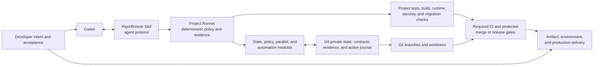
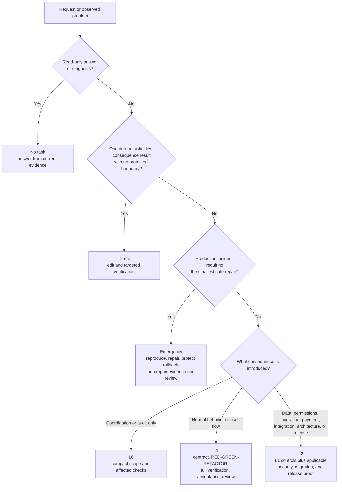
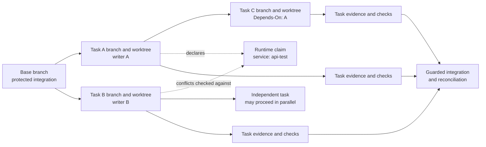

# RigorBreeze Architecture

English · [简体中文](ARCHITECTURE.zh-CN.md)

RigorBreeze is an evidence-backed, consequence-adaptive workflow that helps one
developer use Codex to move an observable change from intent to a safely
verified delivery boundary.

It is deliberately **not** a project-management suite, a replacement for a
team's product decisions, an autonomous deployment system, or a second source
of truth for a project's requirements and CI commands. This document is a
system map; the installable [Skill](rigorbreeze/SKILL.md) is the agent
protocol, the [handbook](rigorbreeze/references/handbook.md) is the engineering
playbook, the [Spec Tree contract](rigorbreeze/references/spec-tree.md) defines
records and retention, and [CI gates](rigorbreeze/references/ci-gates.md)
defines the enforced delivery boundary.

## 1. System architecture

RigorBreeze sits between a developer's stated outcome, Codex's implementation
work, and the repository's protected CI and delivery boundary. The Skill
guides decisions; the project-owned Runner evaluates them deterministically.
Neither replaces the project's tests, runtime checks, branch protection, or
human judgment.

<!-- architecture-overview -->

The repository owns the executable policy: `rigorbreeze.toml` declares checks
and the bundled `scripts/rigorbreeze.py` runs them. The runner's internal state,
policy, parallel, and automation modules make that policy inspectable across
Codex windows without turning chat history into a control plane.

### Boundaries and responsibilities

| Boundary | Owns | Does not own |
|---|---|---|
| Developer | Outcome, acceptance decisions that need a human, standing Git/release authority | Mechanical execution of every workflow command |
| Codex + Skill | Context recovery, risk routing, compact contracts, implementation discipline, and clear handoffs | Inventing product intent or approving its own high-consequence decision |
| Project Runner | Task state, scope, evidence freshness, checks, worktree/resource conflicts, and guarded automation | Replacing the project's test framework, CI service, or deployment platform |
| Project tools | Build, tests, runtime, security, migration, artifacts, and observability evidence | Defining an alternative workflow policy |
| Git, CI, and environments | Immutable history, protected integration, required checks, and production controls | Reconstructing missing local task evidence from a chat transcript |

## 2. Risk-adaptive workflow

The lane follows the consequence of a result, not the number of changed lines,
how long the work took, or how urgent it sounds. Read-only questions use no
task. Direct avoids task machinery only for one deterministic, low-consequence
result with no protected boundary. L0 coordinates a non-behavioral or isolated
low-risk change; L1 is normal product behavior; L2 covers consequential
boundaries; Emergency contains the smallest safe production repair and repairs
evidence afterwards.

<!-- risk-lanes -->

The diagram is an orientation aid, not a shortcut around the lane criteria.
Before an L1/L2 contract freezes its baseline, the task worktree must be clean
apart from task-owned records and private state. Foreign delivery changes or
unignored caches stop approval; Direct and L0 keep their lighter contracts.
For exact task creation, approval, closure, and escalation rules, use the
[handbook](rigorbreeze/references/handbook.md) and the [Skill](rigorbreeze/SKILL.md).

## 3. The three delivery loops

RigorBreeze keeps three linked loops distinct so that a passing command is not
mistaken for a delivered outcome.

1. **Requirement loop:** recover authoritative context, state one observable
   outcome, map its acceptance IDs and exclusions, then freeze the compact
   task contract before implementation.
2. **Evidence loop:** bind an acceptance ID to an independent expected failure,
   make the minimum change through a public seam, run relevant checks, and
   retain only evidence whose fingerprints are still current.
3. **Delivery loop:** validate the real entry point when it applies, review the
   implementation and the specification separately, archive honestly, then
   perform only authorized Git or release actions and reconcile the result.

These loops meet at the task contract and its evidence record. The contract
answers *what must be true*; evidence answers *what was observed*; Git and CI
control *what may move onward*.

## 4. Parallel work: branches, worktrees, claims, and the DAG

Every independent non-Direct outcome has one short-lived task branch. A
physical worktree has one writer. Worktrees isolate files, but not ports,
services, processes, applications, or environments; `Runtime-Claims` exposes
those real shared resources before work begins. A DAG is used only when tasks
have a real ordering constraint, and `Depends-On` in the contracts remains the
only authoritative dependency representation.

A feature, task, branch/worktree, and pull request are separate layers. One
feature and final PR may contain several independently verified sequential
tasks on the same clean integration stream. Each slice archives and commits
locally before the next begins; another verification frontier does not require
another PR or worktree.

<!-- parallel-worktrees-dag -->

The runner derives readiness, cycles, missing dependencies, scope overlap, and
runtime conflicts from task contracts plus Git state. It does not create a
second task board. Sequential, related slices may reuse a clean integration
worktree after closure; concurrent writers do not share one.

## 5. Core modules and data flow

The bundled runner is project-local and uses only the Python standard library
at runtime. Its modules have separate responsibilities while sharing one policy
and record model:

| Module | Role in the flow |
|---|---|
| `rigorbreeze.py` | Stable command entry point used by Codex and CI; loads configuration and dispatches policy actions. |
| `flow_state.py` | Reads and writes schema-aware state, contracts, evidence, digests, archive/history data, and atomic private records. |
| `flow_policy.py` | Applies lane, contract, scope, TDD, freshness, verification, and delivery-gate policy. |
| `flow_parallel.py` | Projects task ownership, worktrees, dependencies, and runtime-claim conflicts. |
| `flow_automation.py` | Records idempotent external Git/provider actions and their recovery state without mutating task proof. |
| `rigorbreeze.toml` | Project declaration of profiles, commands, reports, artifacts, timeouts, risk applicability, and standing automation level. |

In the normal data flow, the Skill recovers context and asks the runner for
current status. The runner combines the approved contract, Git/worktree state,
and project configuration to select or validate a lane. Project tools emit
checks and artifacts; the runner fingerprints the inputs and records compact
results. CI re-runs the same project-declared full profile in an enforced
environment, while protected branches and environments remain the final
non-bypassable boundary.

## 6. Evidence, freshness, and privacy

Version-5 projects keep active contracts and detailed evidence in the Git
common directory under `.git/rigorbreeze/records/`, so linked worktrees can see
one private source of workflow truth without placing it in product commits.
`state.json` is worktree-local; the common registry is derived convenience
state, not a requirement source.

Evidence is bound to the task digest, project/configuration fingerprint, Git
state, acceptance/test digests, and relevant external facts. A change to the
contract, implementation, test, configuration, dependency, migration, scope,
or applicable external state invalidates stale proof. An unchanged successful
full profile can be reused; `--force` is reserved for an explicit rerun. This
keeps iteration fast without treating an old green result as current evidence.

After UAT, visual/runtime review, or a follow-up request, a new product write
re-enters current status and scope. Same-result in-scope feedback invalidates
old proof and resumes implementation; a forbidden path, another active owner,
or a new outcome becomes a successor task or visible handoff.

Privacy is part of the architecture:

- detailed contracts, command results, and automation recovery data stay
  Git-private by default;
- integrated L1 detail is compacted to a path-free local history summary;
- L2 and Emergency may publish only a bounded, sanitized audit summary when a
  project configures it;
- audit summaries exclude absolute paths, raw output, credentials, and
  production data; and
- the Skill has no telemetry and must not use task evidence to store secrets or
  sensitive full logs.

The exact retention, legacy compatibility, record authority, and invalidation
rules are defined by the [Spec Tree contract](rigorbreeze/references/spec-tree.md).

## 7. Git automation and release recovery

Automation is conservative by design. The project's `[automation].level`
defaults to `manual`, so normal operation grants no unattended Git write. A
developer may provide one current-message authorization for a guarded commit or
push without raising the standing level; that does not authorize merge, release,
migration, or rollback. Pushes fetch first, require fast-forward history, never
force-push or rebase, and verify the resulting remote SHA.

External-action state is stored privately in `automation.json` and keyed to
immutable inputs. Before a new external action, the runner reconstructs the
observed state: completed steps, immutable identifiers, the remaining action,
and stop conditions. This makes a pause or retried Codex window resume safely
instead of replaying a stale checklist.

Archive is not release. A production release remains an L2 operation with one
Git SHA and immutable artifact through verification and acceptance, a frozen
operation scope, ordered safe recovery points, stop conditions, and documented
rollback limitations. A paused or failed operation records one safe state and
one resume action. Required CI and protected environments are the enforcement
boundary; the runner coordinates evidence but is not a deployment scheduler.
See [CI gates](rigorbreeze/references/ci-gates.md) for the authoritative
enforcement and artifact rules.

## 8. What RigorBreeze solves—and what it does not

RigorBreeze helps a solo developer:

- turn a chat request into a bounded, observable change instead of a vague
  implementation session;
- scale workflow effort to consequence while retaining a genuinely lightweight
  Direct lane;
- preserve task state and proof across sessions and parallel Codex windows;
- detect stale verification, scope drift, conflicting writers, and shared
  runtime resources before they create hidden risk;
- reuse current verification safely and retain private evidence without adding
  a large tracked document tree; and
- make optional Git and release automation recoverable and deliberately
  authorized.

It cannot:

- decide an outcome that the available project evidence cannot establish;
- make a broken, missing, or poorly configured project check meaningful;
- substitute AI judgment for a visual baseline, security exception, legal
  conclusion, real user acceptance, or production-release decision;
- safely bypass CI, branch protection, environment approval, or organization
  policy; or
- replace issue tracking, staffing, sprint planning, product research, or a
  multi-team coordination platform.

## 9. Choosing Direct, L1, or L2

Use these examples as quick consequence checks, then apply the exact definitions
from the [Skill](rigorbreeze/SKILL.md):

| Situation | Typical lane | Why |
|---|---|---|
| Correct one deterministic label, display order, or low-consequence rendering issue; no concurrent writer and no protected boundary | Direct | One small result can be proven by a targeted check without a task record. |
| Add a profile-editing behavior, repair a normal user flow, or change a multi-file feature with observable acceptance | L1 | The behavior needs a compact contract, observed RED-GREEN-REFACTOR, full verification, real acceptance where applicable, and review. |
| Change permission semantics, personal/sensitive data handling, a migration, payment, third-party integration, production configuration, or release behavior | L2 | The consequence crosses a protected boundary and needs the applicable security, migration, integration, artifact, and/or release evidence. |

If a supposed Direct change reveals ambiguity, concurrent ownership, an API or
persisted-data semantic, permission, payment, migration, dependency,
production-config, external-state, or release impact, stop and route it to L1
or L2. L0 remains available for coordinated documentation or isolated
non-behavioral work; it is not a way to avoid L1/L2 controls.

## 10. Where to go next

- Start with the [README](README.md) for installation and a first task.
- Read the [Skill](rigorbreeze/SKILL.md) for the agent's operating contract.
- Read the [handbook](rigorbreeze/references/handbook.md) for task shaping,
  lifecycle, review, parallel work, automation, and release details.
- Read the [Spec Tree contract](rigorbreeze/references/spec-tree.md) for record
  authority, storage, freshness, and retention.
- Read [CI gates](rigorbreeze/references/ci-gates.md) for enforced checks,
  artifact identity, and protected delivery.
