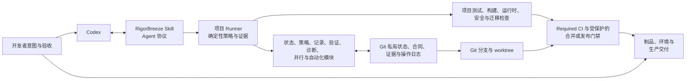
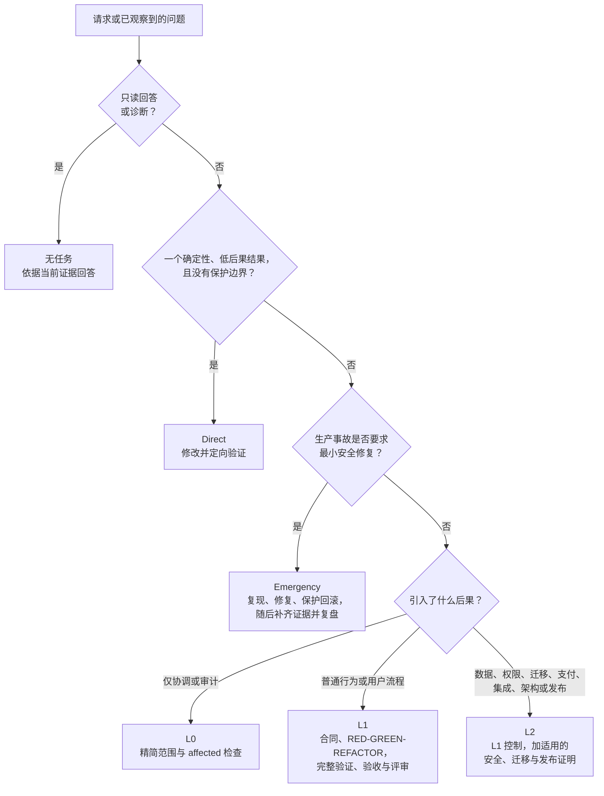
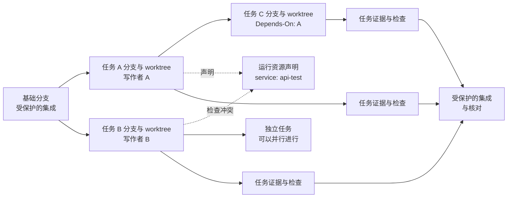

# RigorBreeze 总体架构

[English](ARCHITECTURE.md) · 简体中文

RigorBreeze 是一套由证据支撑、按后果自适应的工作流，帮助一位开发者借助 Codex，
将一个可观察的变更从意图推进到经过安全验证的交付边界。

它刻意**不是**项目管理套件、团队产品决策的替代品、自治部署系统，或项目需求和 CI
命令的第二事实源。本文是系统地图：可安装的 [Skill](rigorbreeze/SKILL.md) 是 Agent
协议，[handbook](rigorbreeze/references/handbook.zh-CN.md) 是工程操作手册，
[Spec Tree 合同](rigorbreeze/references/spec-tree.zh-CN.md) 定义记录和保留规则，
[CI gates](rigorbreeze/references/ci-gates.zh-CN.md) 定义强制执行的交付边界。

## 1. 系统架构

RigorBreeze 位于开发者表述的结果、Codex 的实现工作，以及仓库受保护的 CI 和交付
边界之间。Skill 指导决策，项目所属的 Runner 以确定性方式评估它们。两者都不替代
项目自己的测试、运行时检查、分支保护或人工判断。

<!-- architecture-overview -->

仓库拥有可执行策略：`rigorbreeze.toml` 声明检查，随附的
`scripts/rigorbreeze.py` 执行它们。Runner 内部的状态、策略、记录、验证、诊断、并行和自动化模块，
让不同 Codex 窗口中的策略保持可检查，而不会把聊天记录变成控制平面。

### 边界与职责

| 边界 | 负责 | 不负责 |
|---|---|---|
| 开发者 | 结果、需要人工判断的验收决策、常设 Git/发布授权 | 每一条工作流命令的机械执行 |
| Codex + Skill | 恢复上下文、风险分流、精简合同、实现纪律和清晰交接 | 编造产品意图，或批准自身的高后果决策 |
| 项目 Runner | 任务状态、范围、证据新鲜度、检查、worktree/资源冲突和受保护自动化 | 替代项目测试框架、CI 服务或部署平台 |
| 项目工具 | 构建、测试、运行时、安全、迁移、制品和可观测性证据 | 定义另一套工作流策略 |
| Git、CI 与环境 | 不可变历史、受保护集成、Required Checks 和生产控制 | 从聊天记录重建缺失的本地任务证据 |

## 2. 风险自适应工作流

通道由结果的后果决定，而不是改了多少行、工作耗时或听起来有多紧急。只读问题不建立
任务。只有一个确定性、低后果且没有保护边界的结果才能走 Direct，因而避免任务机制；
L0 协调非行为性或隔离的低风险变更；L1 覆盖普通产品行为；L2 覆盖高后果边界；
Emergency 先控制最小安全的生产修复，再补齐事后证据。

<!-- risk-lanes -->

图示只用于快速定位，不能绕过通道标准。L1/L2 合同冻结基线前，任务 worktree 必须保持
干净，只允许任务自有记录与私有状态变化；外来交付改动或未忽略缓存会阻断批准，Direct
与 L0 继续使用轻量合同。准确的任务创建、批准、关闭和升级规则，应以
[handbook](rigorbreeze/references/handbook.zh-CN.md) 和
[Skill](rigorbreeze/SKILL.md) 为准。

## 3. 三个交付闭环

RigorBreeze 将三个相互连接的闭环明确分开，避免把一条通过的命令误认为已交付的结果。

1. **需求闭环：**恢复权威上下文，写清一个可观察结果，映射验收 ID 与排除项，再在实现
   前冻结精简任务合同。
2. **证据闭环：**将验收 ID 绑定到独立的预期失败，经由公共接缝完成最小改动，运行相关
   检查，并只保留指纹仍然有效的证据。
3. **交付闭环：**适用时验证真实入口，分别评审实现和规格，如实归档，再执行已授权的
   Git 或发布动作并核对结果。

这三个闭环在任务合同及其证据记录相交。合同回答*什么必须成立*；证据回答*实际观察到
什么*；Git 与 CI 控制*什么可以继续向前推进*。

## 4. 并行工作：分支、worktree、声明与 DAG

每个独立的非 Direct 结果都有一个短期任务分支。一个物理 worktree 只允许一位写作者。
worktree 隔离文件，却不能隔离端口、服务、进程、应用或环境；`Runtime-Claims` 在开工
前暴露这些真正共享的资源。只有任务存在真实排序约束时才使用 DAG，并且合同中的
`Depends-On` 始终是唯一的权威依赖表示。

功能、任务、分支/worktree 与 PR 属于不同层级。一个功能和最终 PR 可以在同一条干净
integration 流上包含多个可独立验证的顺序任务；每个切片先归档并本地提交，再开始下一项，
新增验证边界不要求额外创建 PR 或 worktree。

<!-- parallel-worktrees-dag -->

Runner 从任务合同和 Git 状态推导就绪性、循环依赖、缺失依赖、范围重叠和运行资源
冲突；它不会建立第二个任务看板。顺序相关的切片可在关闭后复用干净的集成 worktree，
并发写作者绝不共享同一个 worktree。

## 5. 核心模块与数据流

随附 Runner 保持项目本地化，运行时只依赖 Python 标准库。各模块共享同一套策略和记录
模型，但职责分离：

| 模块 | 在流程中的作用 |
|---|---|
| `rigorbreeze.py` | Codex与CI使用的稳定薄命令入口；解析命令、持有锁并分发内核动作。 |
| `flow_state.py` | 提供有Schema意识的状态、配置、摘要、原子I/O和唯一安装helper清单。 |
| `flow_policy.py` | 应用通道、合同、范围、TDD、新鲜度、验证与交付门禁策略。 |
| `flow_parallel.py` | 投影任务所有权、worktree、依赖与 Runtime-Claims 冲突。 |
| `flow_automation.py` | 记录幂等的外部 Git/Provider 动作及其恢复状态，不篡改任务证明。 |
| `flow_records.py` | 负责evidence录入、复盘、归档关闭、私有保留、迁移和脱敏审计摘要。 |
| `flow_verification.py` | 执行环境预检、RED观察、affected/full、结果复用和交付检查。 |
| `flow_diagnostics.py` | 投影安装、基线、生命周期、交互、聚合状态和doctor结果。 |
| `rigorbreeze.toml` | 项目对 profiles、命令、报告、制品、超时、风险适用性和常设自动化等级的声明。 |

在通常的数据流中，Skill 恢复上下文并向 Runner 请求当前状态。Runner 结合已批准合同、
Git/worktree 状态与项目配置，选择或验证通道。项目工具产出检查和制品；Runner 为输入
生成指纹并记录精简结果。CI 在受强制约束的环境中重新运行同一份项目声明的 full
profile，而受保护分支与环境仍是最终不可绕过的边界。

## 6. 证据、新鲜度与隐私

版本 5 项目将活动合同和详细证据保存在 Git 公共目录的
`.git/rigorbreeze/records/` 中，因此链接的 worktree 可看见同一份私有工作流事实源，
而无需把它放进产品提交。`state.json` 属于 worktree 本地状态；共享 registry 是派生的
便利状态，而不是需求事实源。

证据绑定到任务摘要、项目/配置指纹、Git 状态、验收/测试摘要和相关外部事实。合同、
实现、测试、配置、依赖、迁移、范围或适用外部状态发生变化，都会使旧证明失效。未变化的
成功 full profile 可以复用；`--force` 只用于明确要求的重跑。这样既保持迭代速度，也不把
旧的绿色结果当作当前证据。

UAT、视觉/运行验收或后续请求之后如需再次写产品代码，必须重新进入当前状态和范围。
范围内同一结果会让旧证明失效并恢复实现；禁止路径、其他活动负责人或新增结果则形成后续
任务或可见交接。

隐私是架构的一部分：

- 详细合同、命令结果和自动化恢复数据默认保留在 Git 私有区域；
- 已集成 L1 的详细记录压缩为不含路径的本地历史摘要；
- 项目若配置，L2 与 Emergency 仅可发布受限、脱敏的审计摘要；
- 审计摘要排除绝对路径、原始输出、凭据和生产数据；以及
- Skill 没有遥测功能，且不得用任务证据存储密钥或敏感完整日志。

准确的保留、遗留兼容、记录权威性和失效规则由
[Spec Tree 合同](rigorbreeze/references/spec-tree.zh-CN.md) 定义。

## 7. Git 自动化与发布恢复

自动化在设计上保持保守。项目的 `[automation].level` 默认值为 `manual`，因此日常操作
不会获得无人值守的 Git 写入权限。开发者可在当前消息中一次性授权受保护的 commit 或
push，而不提高常设等级；这并不授权 merge、release、迁移或回滚。push 会先 fetch，要求
fast-forward 历史，绝不 force-push 或 rebase，并验证得到的远端 SHA。

外部动作状态私有地保存在 `automation.json` 中，并由不可变输入键控。执行新的外部动作
前，Runner 会重建已观察到的状态：已完成步骤、不可变标识、剩余动作和停止条件。这使得
暂停或重试后的 Codex 窗口能够安全恢复，而不是重放过时清单。

归档不是发布。生产发布仍是 L2 操作：同一 Git SHA 与不可变制品须贯穿验证和验收，操作
范围必须冻结，安全恢复点与停止条件必须按序明确，并记录回滚限制。暂停或失败的操作记录
一个安全状态和一个恢复动作。Required CI 与受保护环境才是强制边界；Runner 协调证据，
但不是部署调度器。权威的强制执行和制品规则见
[CI gates](rigorbreeze/references/ci-gates.zh-CN.md)。

## 8. RigorBreeze 能解决什么，以及不能解决什么

RigorBreeze 帮助独立开发者：

- 将聊天请求转化为有边界、可观察的变更，而不是含糊的实现会话；
- 按后果调节流程投入，同时保留真正轻量的 Direct 通道；
- 跨会话和并行 Codex 窗口保留任务状态与证明；
- 在风险变得隐蔽之前，发现旧验证、范围漂移、冲突写作者和共享运行资源；
- 安全复用当前验证，并保留私有证据而不增加庞大的受跟踪文档树；以及
- 让可选的 Git 与发布自动化能够恢复，且只在经过慎重授权时执行。

它不能：

- 在现有项目证据无法确定时替人决定结果；
- 让已损坏、缺失或配置不当的项目检查变得有意义；
- 用 AI 判断替代视觉基线、安全例外、法律结论、真实用户验收或生产发布决策；
- 安全绕过 CI、分支保护、环境批准或组织策略；或者
- 替代缺陷跟踪、人员配置、迭代规划、产品研究或多团队协作平台。

## 9. 如何选择 Direct、L1 或 L2

将下列示例作为快速后果判断，随后仍应应用 [Skill](rigorbreeze/SKILL.md) 中的精确定义：

| 情形 | 常见通道 | 原因 |
|---|---|---|
| 修正一个确定性的标签、展示顺序或低后果渲染问题；没有并发写者和保护边界 | Direct | 单一小结果可用定向检查证明，不需要任务记录。 |
| 新增资料编辑行为、修复普通用户流程，或修改具有可观察验收的多文件功能 | L1 | 此行为需要精简合同、观察到的 RED-GREEN-REFACTOR、完整验证、适用时的真实验收与评审。 |
| 修改权限语义、个人/敏感数据处理、迁移、支付、第三方集成、生产配置或发布行为 | L2 | 后果跨越保护边界，需要适用的安全、迁移、集成、制品和/或发布证据。 |

若一个本应走 Direct 的改动暴露出歧义、并发所有权、API 或持久化数据语义、权限、支付、
迁移、依赖、生产配置、外部状态或发布影响，应停止并改走 L1 或 L2。L0 仍可用于协调性
文档工作或隔离的非行为性工作；它不是避开 L1/L2 控制的方式。

## 10. 下一步阅读

- 从 [README](README.md) 开始，了解安装和第一个任务。
- 阅读 [Skill](rigorbreeze/SKILL.md)，了解 Agent 的操作合同。
- 阅读 [handbook](rigorbreeze/references/handbook.zh-CN.md)，了解任务塑形、生命周期、
  评审、并行工作、自动化和发布细节。
- 阅读 [Spec Tree 合同](rigorbreeze/references/spec-tree.zh-CN.md)，了解记录权威性、
  存储、新鲜度和保留。
- 阅读 [CI gates](rigorbreeze/references/ci-gates.zh-CN.md)，了解强制检查、制品身份和
  受保护交付。
