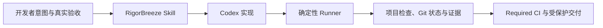

# RigorBreeze

**生产级严谨，轻量化执行。**

一套面向个人开发者、证据驱动且风险自适应的 Codex AI 工程工作流。

[](#public-preview-与-v10)
[](https://github.com/nightbreezesjc/rigorbreeze/actions/workflows/ci.yml)
[](https://www.python.org/)
[](LICENSE)

[English](README.md) · 简体中文

RigorBreeze 按后果分流工作：安全小改走经过验证的 Direct 通道，普通变更使用精简私有记录，生产高风险任务保留完整证据和公开的脱敏审计摘要。它刻意小于项目管理系统，让日常流程记录不再混入产品提交。

> **Public Preview：** v0.21.0 当前可以使用。它保留v0.20.1验证与顺序任务归属，并把旧Schema预检和迁移后断言明确分阶段。活动项目仍冻结其已安装 Runner，任务关闭后再升级。

## 为什么需要它

AI 可以很快生成代码，但仍可能做错业务行为、遗漏设计状态，或者让测试通过却没有证明用户结果。对于长期项目和多个 Codex 窗口，聊天历史也不是可靠的事实源。

RigorBreeze 把人的注意力放到最关键的开头和结尾：

```text
先对齐用户结果和验收边界
→ Codex 在可观察反馈循环中实现
→ 人在真实运行环境中验收结果
```

它补充可审计 SDD、真实 RED–GREEN–REFACTOR、项目声明式检查、真实验收、安全并行 worktree 和可选的受保护 Git 自动化，同时保持最小 Spec Tree。

## 架构一览



RigorBreeze 位于开发者意图、Codex 执行和不可绕过的交付边界之间。Skill
约束 Agent 行为，Runner 使用项目自己的工具和 Git 私有记录证明范围、新鲜度、风险与
交付条件。完整的系统、风险通道、证据、并行 worktree 和发布恢复模型见
[总体架构](ARCHITECTURE.zh-CN.md)。

## 它适合谁

适合：

- 使用 Codex App 或 Codex CLI 的个人开发者；
- 需要跨 Session 或多个 Codex 窗口长期维护产品；
- 交付涉及测试、设计还原、权限、迁移或回滚的真实功能；
- 愿意确认一份精简任务合同并亲自查看真实结果。

不适合：

- 出错成本很低的一次性脚本和周末原型；
- 需要团队排期、人员管理、Issue 看板或 Agent 控制台的组织；
- 完全无法配置构建、测试或验收命令的项目；
- 希望 AI 自己批准视觉、安全、法务或生产结论的流程。

当前正式支持 Codex App 和 Codex CLI。其他兼容 Agent Skills 的工具可能能够加载本 Skill，但在完成安装和行为验证前只属于实验性支持。

## 60 秒安装

前置条件：Git、Python 3.11 或更高版本、Codex App 或 Codex CLI。

### 方式 A：Agent Skills 安装器

```bash
npx skills@latest add nightbreezesjc/rigorbreeze --skill rigorbreeze -g -a codex -y
```

`skills` CLI 是第三方安装器，拥有自己的遥测策略。如果不希望安装器发送遥测，可为该命令设置 `DISABLE_TELEMETRY=1`，或者使用下面的手工安装方式。

安装完成后重启或重新加载 Codex。

### 方式 B：Git clone 后复制

在你存放开发工具的目录中执行：

```bash
git clone https://github.com/nightbreezesjc/rigorbreeze.git
mkdir -p ~/.codex/skills
cp -R rigorbreeze/rigorbreeze ~/.codex/skills/rigorbreeze
```

如果要参与本 Skill 开发，可以从独立贡献者工作区创建软链接，而不执行最后一条复制命令：

```bash
ln -s "$(pwd)/rigorbreeze/rigorbreeze" ~/.codex/skills/rigorbreeze
```

外层目录是 GitHub 仓库，内层目录才是可安装 Skill。

普通使用者应使用安装器管理的副本或固定到稳定发布版本的独立 checkout。贡献者工作区是实时开发通道：存在未提交修改或活动 RigorBreeze 任务时不要拉取更新。项目 Runner 与 Skill 安装分别管理；只有状态显示 `installation.status=outdated` 且 `upgradeSafe=true` 时才升级，活动任务关闭前继续使用原 Runner。

### 验证安装

在一个 Git 项目中新建 Codex 任务并输入：

```text
$rigorbreeze 检查这个项目并告诉我工作流是否已经初始化
```

Codex 应当加载 Skill、检查仓库，并报告当前 `nextAction` 或提出初始化项目。

## 在首个任务前塑形项目

当想法属于新产品、新业务域、大范围旧系统迁移，或者仍然包含多个可能结果时，
先让 RigorBreeze 完成产品塑形，再创建交付任务：

```text
$rigorbreeze 在创建任务前先塑形这个项目。先恢复项目事实，区分证据、假设和未知；比较两到三个可行方案；覆盖用户旅程、期望结果、成功指标、四类产品风险、投入边界、风险坑和明确不做；推荐首个纵向切片，并等待我批准。
```

这一步是按需的。边界清楚的普通功能或缺陷仍直接进入任务合同。塑形优先复用
一个有版本的产品/设计来源，必要时只在 Spec Tree 之外建立一份精简简报；不会
制造 PRD 文档树、实施 DAG，也不会从角色提示或参考源码中虚构产品真相。批准后，
RigorBreeze 会先恢复事实，然后每轮最多询问三个当前决策前沿问题，并为每题提供
推荐答案、理由以及对结果或范围的影响。可丢弃原型只回答一个决策问题并记录观察
结果和结论，不能冒充生产验收。决策全部闭合且简报批准后，只有首个切片进入任务。

## 第一个真实任务

正常使用时，你在 Codex 对话中描述目标，不需要自己操作每一条内部命令：

```text
$rigorbreeze 初始化这个项目，并开发一个允许用户修改显示名称的个人资料页面
```

Codex 会：

1. 读取当前项目，并从权威需求、代码、测试、Git 和运行证据中补全缺失上下文；
2. 提出一份包含范围、验收 ID、风险和测试接缝的可观察任务；
3. 清晰的 L1 请求直接作为批准依据，只在结果仍有歧义时询问；
4. 为 L1/L2 行为观察 RED，小步实现 GREEN，并执行项目检查；
5. 展示适用的真实页面、接口、真机、迁移或运行证据；
6. 在需要时请你做真实验收；首次通过的干净 L1 自动关闭，有摩擦的 L1 和全部 L2/Emergency 才保留人工复盘。

你只判断不能安全自动化的部分：未决结果选择、适用的真实验收，以及流程摩擦或高风险结论。内部命令和证据由 Codex 执行与记录。

RigorBreeze 不会把每次对话都变成任务。查询状态、解释日志、分析截图、给建议和其他不写代码的诊断走“无任务通道”：先回答问题，再单独报告相关漂移，不能把修复工作流状态作为只读回答的前置条件。需要写代码时，选择能够覆盖后果的最低通道：

| 请求 | 默认通道 |
|---|---|
| 解释状态、日志、截图或下一条命令 | 不建任务 |
| 文案、孤立样式、简单字段显示或低后果小 Bug | Direct：修改＋定向验证，不建任务 |
| 仍需协调或审计的低风险多文件修改 | L0 |
| 普通功能、缺陷或可观察行为 | L1 |
| 数据、支付、权限、外部集成、基础设施或生产写入 | L2 |

风险由后果决定，不由代码行数、耗时或需求是否紧急决定。如果流程准备成本超过一个真正隔离的 L0 修改，Codex 应删除无关仪式；但绝不能为了省时间把 L2 后果降级。

一个产品功能和最终 PR 可以包含多个 RigorBreeze 任务。每个可独立验证的边界在同一个干净 integration 分支/worktree 上依次关闭并本地提交，再进入下一相关切片；人的批准和最终验收保持合并。一个PR不代表必须压成一个巨型任务，顺序切片也不需要各建一个worktree或PR。

你不需要先写出完美提示词，也不必添加“你是互联网独角兽 CTO”之类的人设。RigorBreeze 会自行恢复项目事实、当前行为、架构路径、不变量以及数据新鲜度/兜底语义；只有证据无法确定且会显著改变结果的意图才询问你。执行外部 Git、部署、开发者工具或平台写操作前，它会先说明已经完成什么、当前不可变标识、唯一剩余动作和停止条件，避免重放旧清单。

批准前，RigorBreeze 会检查占位符、内部矛盾、过大切片，以及结果/事实源/兜底语义歧义。L1/L2 还必须使用干净任务工作树：外来产品改动和未忽略缓存会在基线建立前阻断。复合需求会拆成可观察的 ADD/REMOVE/MOVE/RETAIN/REPLACE 原子，每项映射到验收或明确不做；扩大范围前先证明问题属于错误/缺失数据、错误配置还是缺少能力，并把最小修正与可选预防分开。UI 最终状态清单覆盖必须存在、必须不存在、位置/顺序和保留行为。否定表达会根据证据判断是在描述当前问题还是目标结果，只有方向仍会改变结果时才问一个简短问题。UAT、视觉/运行验收或后续沟通后再次写产品代码时，必须重新进入当前状态和范围：范围内同一结果会让旧证明失效，禁止范围或新结果则建立后续任务或可见交接。未被运行证据区分的根因只能标为假设；人工验收必须说明真实 route/menu/role/account/device 入口，或者诚实写成 `N/A` 并给出等价运行/API 证据。登录、token、浏览器或渠道连续两次同样失败后，Skill 会保留安全状态并切换方法，不再沿原路径重试。涉及三个或更多相关页面或新的视觉语言时，必须先做一个 visual tracer，除非只是精确复用已批准组件。完成声明必须说明本轮新运行的命令、退出状态和覆盖范围；评审建议先与仓库事实和 YAGNI 对照，推测性层级接受删除测试；同一缺陷连续三个假设失败后进入架构停点。维护者使用二十二个确定性 Agent 压力场景验证这些规则；测试资产不会安装到业务项目，CI 也不会调用真实模型。

Allowed Scope 只能填写仓库相对路径、目录前缀或 glob；`*` 只匹配一层路径，`**` 才跨目录。验收条件必须使用唯一且机器可读的 ID。不能在生产代码变化之上重新批准：应恢复已批准合同并完成，或先回退生产变化，再修订同一用户结果。新增用户结果或验收条件才建立依赖切片。

初始化并配置检查后，应在创建 L1/L2 前建立 Git 工作流基线；Direct 和 L0 保持轻量。`status --json` 报告真实基准分支状态，明确授权后 Codex 可建立不混入产品代码的一次性基线提交。安装后的 Skill 使用自身 v0.21.0 bundled runner，分别报告缺失或被修改的组件，实施中不会静默升级。高风险合同丢失时必须恢复记录或建立明确 Emergency 合同，不能用手工任务卡绕过。

初始化后，项目会包含：

```text
spec/
├── index.md
└── evidence/TASK-002.audit.json  # 仅脱敏 L2/Emergency 审计摘要

rigorbreeze.toml               # 项目检查与策略
scripts/rigorbreeze.py         # 本地和 CI 使用同一个执行器
.git/rigorbreeze/state.json    # 私有状态，永不提交
.git/rigorbreeze/records/      # 私有合同、证据、归档与历史
```

检查下一动作的标准命令是：

```bash
python3 scripts/rigorbreeze.py status --json
```

这条命令主要由 Codex、CI 和故障排查使用。完整 CLI 语法以 `python3 scripts/rigorbreeze.py --help` 为准。

## 工作流如何运行

```text
先分流只读 / Direct / L0 / L1 / L2 / Emergency
→ 仅在项目结果尚未稳定时完成项目塑形
→ 定义一个垂直切片
→ 批准任务摘要
→ 观察 RED
→ 实现 GREEN 并重构
→ 执行 affected/full profile
→ 检查真实运行结果
→ 分别进行规范审查和规格审查
→ 干净 L1 自动关闭，或确认适用的预填复盘
→ archive
→ 按需执行受保护的 commit/push/merge
→ reconcile 并清理已集成 worktree
```

门禁成本随风险变化：

| 通道 | 典型变更 | 关闭要求 |
|---|---|---|
| Direct | 一个无歧义、低后果结果 | 一项定向检查；不建任务和证据 |
| L0 | 需要协调或审计的低风险修改 | 配置的 affected 检查 |
| L1 | 普通功能、修复或用户流程 | RED、full、真实验收、审查、复盘 |
| L2 | 权限、敏感数据、迁移、支付、集成、发布 | L1 加适用的安全、迁移和发布控制 |
| Emergency | 最小安全生产热修 | 故障复现、关键回归、回滚和证据修复 |

任务归档不等于生产发布。不可变制品、灰度、SLO、告警和回滚证据只在明确请求生产发布时进入门禁。

远程发布开始后，已经批准的操作范围被冻结。新发现的关键风险会停止当前发布；无关的基础镜像、操作系统、数据库引擎、扫描器、框架或平台升级必须成为独立治理任务，不能临时塞进普通业务部署。跨任务工作必须在执行前明确展示目标任务、可观察结果、允许与禁止范围、依赖或阻塞项及负责人。

对于条件化 L2 外部集成，`Operational-Modes` 将启用、关闭和依赖不可用行为绑定到真实验收 ID。L2 发布执行远程写操作前，机器 JSON 操作计划必须绑定准确 SHA/制品，并列出备份、配置冻结、迁移、部署、验收、切换、观察阶段及其成功条件、停止条件、安全恢复点和回滚限制。暂停或失败时只记录一个当前安全状态和一个恢复入口，避免盲目重跑整套发布。

## 最小 Spec Tree

Direct 修改不生成工作流文件。任务型工作最多只有一份人工合同和一份机器证据；需求用引用连接，不复制成文档迷宫。

任务合同记录当前依据、机器可检查的允许和禁止范围、验收 ID、测试接缝、独占 `Runtime-Claims`、条件化 `Operational-Modes` 和适用风险。证据 JSON 记录批准摘要、RED、检查、报告、验收、制品身份、发布操作快照和复盘事实。相关源码、测试、配置、依赖、迁移或任务摘要变化后，旧证据会自动失效。追加全绿验证只刷新机器统计，不要求重复同一份复盘判断；任务/代码事实、失败、验收、绕过或实践事件变化时，判断仍会失效。`status --json` 同时投影安装状态和范围漂移，旧执行器或范围外改动不能被通过的验证掩盖。

v5 项目默认把记录保存在 `.git/rigorbreeze/records/`，所有 worktree 可读取，但不会进入产品提交。L1 集成后只留下不含路径的本地精简摘要；L2/Emergency 保留完整私有证据，并可生成不超过 32 KiB 的脱敏 `.audit.json`，只含风险、验收 ID、不可变摘要、结论和诚实的 `Tested/Not-tested`，禁止绝对路径、原始输出、凭证和生产数据。需要跨机器证据的项目仍可显式选择 `tracked`。

旧 v2-v4 项目保持 tracked 行为，只有在空闲且干净时显式执行 `doctor --all --repair --migrate-records private` 才迁移；升级 Runner 不会静默移动或删除历史证据。

权威顺序和失效规则见安装包内的 [Spec Tree 合同](rigorbreeze/references/spec-tree.zh-CN.md)。

## 安全与隐私默认值

- 本地检查默认 advisory；CI、L2、merge 和 release 使用 enforced。
- Git 自动化默认 `manual`：不允许无人值守的 Git 写操作，但用户对当前任务的明确要求可以单次授权安全 commit 或 push，且不会修改项目长期等级。升级 Skill 不会提高长期权限。
- 不通过 force push 或本地直合绕过受保护分支。
- 受管清理必须证明来源、准确路径、集成和干净状态。仅在无远端不确定性时使用 `git branch -d` 安全删除已包含的本地任务分支；其他分支/worktree 全部保留并说明原因，远端分支永不自动删除。
- 被取消或替代的任务只有在任务范围内工作树干净、外部动作结果明确时，才可按 `abandoned` 归档并释放任务槽和运行资源；分支和 worktree 不会被自动删除。
- 任务修改 `AGENTS.md`、`rigorbreeze.toml` 或执行器等工作流策略文件时，必须把它们显式写入 Allowed Scope。
- 外部动作恢复信息保存在 Git 私有 `.git/rigorbreeze/automation.json`。
- 私有记录留在项目 Git 公共目录；Skill 没有遥测，不上传源码、提示词、证据或指标。
- 任务证据不得保存秘密、凭证、生产数据或包含敏感信息的完整日志。
- 临时或合成凭证只能证明“可以构建”，不能满足真实环境验收、部署或发布证据。
- AI 不能批准自己的视觉基线、安全例外、法务结论或生产发布。

Skill 通过项目配置编排真实的安全、迁移、CI、浏览器、真机和监控工具，不会用内部占位检查冒充这些能力。

## 并行开发与可选自动化

一个物理 worktree 只能有一个活动写任务。风险决定门禁，Direct 之外的每个独立结果使用一个短期分支，只有并发写窗口或可丢弃的高风险实验才增加 worktree。一个任务关闭并集成后，同一窗口复用干净目录，但要先回到当前基准，再为下一个无关任务创建新分支；只有明确相关的连续切片才复用指定 integration 分支。另一个 Codex 窗口需要并行写入时，Skill 会创建隔离的 `rigorbreeze/<task-id>` 分支和 worktree。文件隔离并不能隔离端口、watcher、本地服务、环境和开发者工具；任务只需通过 `Runtime-Claims` 声明实际占用的独占资源，活动声明冲突会被阻断。

可能的 Direct 修正只通过 `status --json --path` 查询目标文件；后端位置和新增回归测试本身不会升级风险。基础工作区只有无关脏文件时，可使用不建任务记录的短期干净 worktree。普通任务读取当前 worktree 状态，并行协调才使用 compact 全局状态。缺失的已集成 worktree 成为清理候选而不是崩溃原因；已集成 worktree 仍有同路径未提交改动时继续视为写者。成功检查只汇总命令、退出码、范围和报告摘要，完整全局状态只用于精确修复、清理和演进。

同一状态结果会展示可清理、需保留和未登记的 worktree，并给出是否干净、集成证明、expected HEAD 和是否需要确认。RigorBreeze 同时识别祖先式 merge 与完整补丁等价的 cherry-pick。已登记任务只有在至少一个产品补丁已经等价进入基准分支，且额外提交全部属于严格白名单工作流元数据时才视为已集成；混合或未匹配产品改动仍保持活动。清理通常只删除创建来源完整且干净的 worktree；未登记清理继续使用原有保守证明，本地分支始终保留。

独立任务不创建 DAG。只有真实先后关系存在时，Codex 才一次提出精简依赖图，并只通过每个任务的 `Depends-On` 保存。该字段只表示同仓库依赖；跨仓库任务在 Authoritative inputs 中关联对方任务和 API/数据契约，提供方尚未集成并验证前，消费方不得完成真实验收。环、缺失依赖、Allowed Scope 重叠、过期基线和重复窗口认领都会被阻断。

项目可以显式提高 `[automation].level`：

```text
manual → commit → push → merge → release
```

每一级包含前一级、只作用于当前任务，并要求对应门禁通过。merge 和 release 通过受保护平台适配器执行；生产迁移和回滚始终需要单独权限。

`manual` 不等于禁止用户明确要求交付。用户清楚要求提交或推送当前任务时，Codex 可以在展示准确的仓库、remote、分支和 HEAD 后使用一次性授权。单次推送会先 fetch，要求 HEAD 未变化，只允许 fast-forward，禁止 force push，完成后核对远端 SHA，并且不会保留授权。直接推送集成分支还必须具备当前 full 验证、验收和审查。merge、release、生产迁移和回滚不会继承该权限。

## 配置检查和 CI

从一个内置适配器开始：

- `rigorbreeze/assets/config/generic.toml`；
- `rigorbreeze/assets/config/java-vue-uniapp.toml`。

复制 `rigorbreeze/assets/ci/` 中的 GitHub Actions 或 GitLab CI 模板，再在 `rigorbreeze.toml` 配置项目真实使用的命令。enforced 模式下，profile 中声明的检查必须存在并通过；不相关能力不需要填写 `N/A`。L2 的 `full` 始终推导出 secrets、build、至少一项静态质量检查和至少一项行为检查；修改依赖时额外要求 dependency、license、SBOM 报告，修改迁移时要求 migration 适配器与报告。

远程 Required Pipeline 才是合并权威，本地 Hook 只能提醒。干净 CI checkout 没有私有任务记录时，enforced `verify --profile full` 可无状态运行项目检查，但结果只代表 Required Check，不能冒充任务验收、归档、合并证据或生产发布。

### 可选真实运行验证包

当运行验收反复成为瓶颈时，通过单独批准的任务创建小型 tracked `verification/` 验证包。它只映射三到五个高风险或高频用户流程，并定义 Launch、Doctor、Drive、Evidence 和 Cleanup。浏览器、模拟器、API 或真机控制仍由项目提供；RigorBreeze 通过现有 `acceptance` 检查校验报告、当前 Git SHA、Feature Map 摘要、证据文件和清理状态。模板位于 `rigorbreeze/assets/verification/`。未显式启用报告的项目和全部 Direct 工作不会增加 Runner 调用。

## 更新与卸载

安装器管理的 Skill 可以这样更新：

```bash
npx skills@latest update rigorbreeze -g -y
```

手工复制方式需要拉取仓库，然后只替换 `~/.codex/skills/rigorbreeze` 中的内层 Skill。软链接方式会随仓库更新。

卸载安装器管理的 Skill：

```bash
npx skills@latest remove rigorbreeze -g -a codex -y
```

手工安装时，只删除 Codex skills 目录中的 `rigorbreeze` 目录或软链接。业务项目已有配置、执行器、私有记录和审计摘要不会被自动删除。

## Public Preview 与 v1.0

v0.21.0 保留v0.20.1的全部命令和门禁、Verification Report schema v1及`startSha`，并要求迁移任务证明旧Schema预检、迁移只执行一次和新Schema断言。配置后的报告可证明 Feature 达到 `typecheck`、`unit`、`integration`、`live-runtime` 或 `device` 等级；HEAD、Feature Map 或证据变化后结论失效。RigorBreeze 仍是质量控制器，不是数据库解析器、浏览器、模拟器或调度平台。状态/配置继续为schema v5，完整evidence继续为schema v4，Automation Journal继续为v1。

v0.12.0 的决策前沿、单问题原型和抽象删除测试合同在本版继续保留。

达到 v1.0 前至少需要完成：

- 一个普通 L1 垂直切片；
- 一个涉及权限、迁移或发布治理的 L2 高风险切片；
- 一次两个 worktree 的真实并行交付；
- 一次至少三个节点的真实依赖 DAG；
- 远程 Required CI 和受保护自动交付演练；
- 一次适用的灰度、监控和回滚演练。

证据还必须证明 `nextAction`、affected/full 选择、证据失效、门禁和复盘减少了返工与逃逸风险，而不是把开发变成填表。完整方法见 [Skill 演进与实践记录](Skill演进与实践记录.md)。

## 仓库协作方式

RigorBreeze 采用 [GitHub Flow](https://docs.github.com/zh/get-started/using-github/github-flow)，不维护永久性的 Git Flow 分支层级：

```text
从最新 main 开始
→ 一个结果对应一个短期分支
→ 提交范围明确的 commit
→ 向 main 发起 Pull Request
→ Required CI 与维护者决策
→ squash 或 rebase 合并
→ 删除已合并分支
```

分支使用 `feat/`、`fix/`、`docs/`、`refactor/` 或 `test/` 等清晰前缀，例如 `docs/clarify-installation`。只有真实发布候选需要稳定时才临时创建 `release/vX.Y.Z`。项目不保留空的 `develop`、`hotfix` 或 release 分支：`main` 是唯一长期事实源，任务分支只负责隔离一项工作，合并后即可删除。

外部贡献者应 fork 仓库，并向 `main` 提交 Pull Request。是否以及何时合并由维护者决定；CI 通过只是必要条件，不会自行合并或发布。可复制的操作步骤和验证要求见[中文贡献指南](CONTRIBUTING.zh-CN.md)。

## 贡献与安全

提交工作流行为修改前阅读[中文贡献指南](CONTRIBUTING.zh-CN.md)。普通摩擦需要在真实切片中重复发生后才进入核心；错误放过秘密、越权、破坏性迁移、过期证据或错误发布的门禁问题需要立即审查。

漏洞请按[中文安全策略](SECURITY.zh-CN.md)私密报告，不要在公开 Issue 中提交秘密或漏洞利用细节。

变更记录见[中文变更记录](CHANGELOG.zh-CN.md)。项目使用英文 [MIT License](LICENSE)，并提供[中文参考译文](LICENSE.zh-CN.md)。

## 设计来源

RigorBreeze 是独立项目，设计参考了：

- [GitHub Spec Kit](https://github.com/github/spec-kit) 的规格驱动对齐；
- [OpenSpec](https://github.com/Fission-AI/OpenSpec) 的轻量变更式 SDD；
- [Superpowers](https://github.com/obra/superpowers) 的可组合工程纪律和先验证再声明；
- [mattpocock/skills](https://github.com/mattpocock/skills) 的小型可适配 Skill 与显式反馈循环；
- [Ponytail](https://github.com/DietrichGebert/ponytail) 的有序最小方案阶梯，以及用真实成本和行为衡量提示规则的原则；
- Lauren Tan 的 PStack 思路，包括项目自有 Feature Map、可执行验证、失败 fixture 评估与渐进式 Agent 信任曲线；
- [Wu5 Dev Flow](https://github.com/WenOwen/wu5-dev-flow) 的可审计任务状态、TDD 证据和 Git 门禁。

这些经验被重新设计成适合个人 Codex 开发的最小 Spec Tree、项目声明式门禁、真实运行验收、隔离并行 worktree 和默认手动交付。本项目与上述项目没有隶属关系，也不声称可以直接替代它们。
